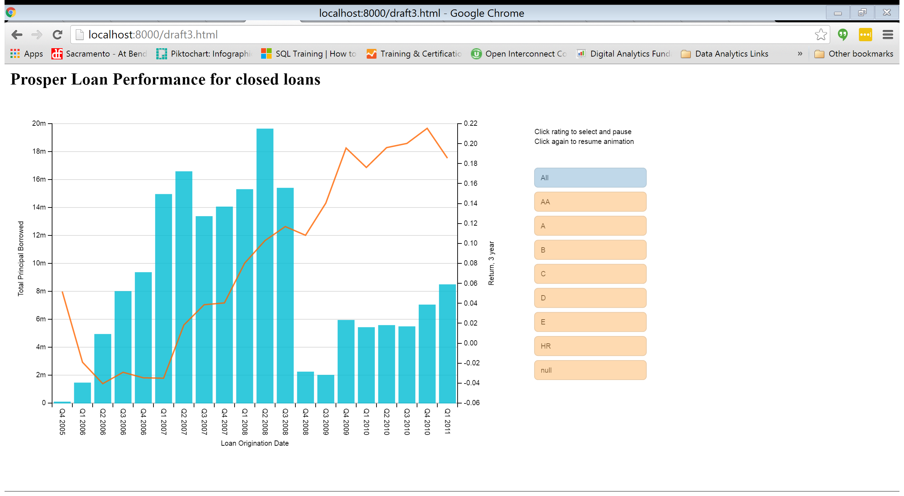

##Summary
This visualization presents Prosper loans as an alternative to investors for other long term fixed investments such as 5 year CDs.  The primary audience is investors in Prosper peer to peer loans (not borrowers or investors in the company).  
The chart clearly shows Prosper loans, on average, provide a better fixed annual return to investors than a 5 year CD.  In addition, while 5 year CD rates have declined, Prosper loans returns have increased over time.  
The time frame presented is specifically from Q3 2009 to Q1 2011.  There are two reasons for this.  
* On July 12,  2009, Prosper loans resumed trading after a 6 month quiet period with three changes to their business model that positively impacted the return on loans for investors.* 
	* Implemented Prosper loan ratings (A through HR) that contributed to the loan rate for the borrower.
	* Transitioned from a variable priced loan determined using an eBay type auction model to a fixed priced loan determined by the Prosper rating
	* Changed the operation model where Prosper issued notes, then purchased loans from a bank.  Propser holds the laons to maturity
* Loans that are not closed do not have sufficient information on expected default rates to accurately predict their final investor returns.    

##Design
The purpose of the visualization is to communicate that Prosper peer to peer loans provide returns which are better than other fixed investments, specifically a 5 year CD.  This story is targeted to the principal lender for an individual loan (not in investor in Prosper the company).  An author directed narrative was selected to communicate the comparison of average annual return for Prosper loans to 5 year CDs.  Users can compare the actual average 5yr CD APR with the actual average annual return for Prosper loans by hovering over each data point.  
A line chart is utilized for the return.  It is an appropriate choice to chart changes over time, and also clearly demonstrates the difference between the two series.  
The axis is scaled from 0-10%.  This provides clarity to the viewer from a few perspectives.  The lower range is set to provide an honest baseline of 0.  The upper range of 10% is a natural point that represents a reasonable upper limit on a fixed investment, and also high enough to not create a distorted, optimistic view of the difference between the two series.   
Text that provides insight to the chart is right below the title, while references are in smaller font below the chart

Some data manipulation was required to the original dataset.  A new field was added, “Instrument”, with a value of “prosper loan” or “5 year CD”.  Values for the 5 year CDs were manually entered and the annual return for the prosper loan was calculated as ((final/original)^(12/Term)-1).  
Propser loans are a simple average of each individual loan for simplicity, and also for consistency with the 5 year CD data.  
The most difficult design decision was what date range to use for the x-axis.  Early versions used the entire date range in the prosper data set, but encountered two issues. 
The return rate prior to Q3 F2009 is on average lower than 5 year CDs, and in some cases, negative.  In Q2 F2009 no loans were issued at all.  This was a strong indication there was a disruption, and so I did further research to understand what had happened to the business.  
After to an SEC mandated quiet period (no loans issued) from Jan 2009-July 2009, Prosper made three significant changes to their business model.  
* They initiated new operational procedures for issuing notes and purchasing loans from WebBank, and holding the notes until maturity.
* The introduced the Prosper Loan Rating and priced the loans accordingly.
* They moved from an auction style pricing model where the borrower and lender used an eBay type variable pricing model to a fixed price model based on the Prosper Loan rating.  

I believe these changes are materially related to the improved performance after Q2 2009, and that it is not misleading to the viewer to only show dates under the new rating and pricing model.  

Similarly, many loans initiated after Q1 2011 are not complete with a loan status of “Current” or “PastDue…”.  It is not possible with the data provided to predict the default and completion rates of any of these loans, so only loans initiated through Q1 2011 are included.  

The data is filtered in the code to remove records prior to Q3 2009 and after Q1 2011 as well as to remove records with LoanStatus != “completed”, “Chargedoff’, or “Defaulted”.  

A few different options were considered for the interactive parameter, but in the end options such as a break down of returns by Prosper Loan Rating, or further information on the count or size of loans (bar and bubble charts) did not add to the narrative.  The final selection is to have a popup at each datapoint with the average return for that instrument and time period.  

##Feedback

The prosper visualization underwent 3 rounds of feedback (including the first Udacity submission).  
**Exploration** – Explore data for trends

 
**Internal Feedback:*	Looking for interesting story on loan returns

**Index** (original Udacity Submission) – Chart return and loan value by quarter.  Scroll through by loan rating and allow user to interact with this feature

 

**Internal Feedback:**	
Current loans have a very low return rate (see discussion in design).  Filter for 36 mos loans and loan origination after Q1 F2011.  Note that chart does not reflect large increase in loan value after 2011.  

**External Feedback**	
* JO:  Returns are flat, and there is an inverse relationship between the return and the principal invested
* JO, LL:  Prosper started investing in lower rated bonds
* LL:  Primary narrative is the relationship between returns and principal
* C4 (Udacity reviewer):  The README file mentions, "The purpose of the visualization is to communicate that Prosper peer to peer loans provide returns which are better than other fixed investments."
That would definitely count as a specific, clear finding; however, the visualization isn't really showing that story. A visualization with that story would show some sort of comparison between more traditional investment vehicles and prosper loans. However, this visualization only shows data of prosper loans.

**Actions:**	After initially ignoring feedback that the visualization didn’t match the desired narrative (viewers see a relationship with principal and return, not return v. an unstated benchmark)…  Selected 5 year CD as a relevant metric that is straightforward to locate as a reference point.  Also, seeing that the loan rating is distracting, and really doesn’t support the narrative.  

**Index3** – line chart of propser loan returns v. a 5 year CD.  

 
**Internal**	
Format axis (%), are yields for propser loans really that good?  Find error in calculation (does not consider term).  Q1 2009 requires explanation.  Move footnotes to bottom.
**External**

*JO:  Prosper loans are really great recently, but what the heck happened before 2009.  I wouldn’t invest in them because maybe they’ll return to that performance.  
*DJ:  gap between CD and loans is growing, well at least until 2011.
*DJ:  is there a difference between other investments, CDs and 5 year CDs?  
*DJ:  What happened in Q1 2009?

**Actions**	Clean up descriptions.  Look at filtering data prior to 2009 if it is justified.  Investigate issues in 2011 – was there a big decline in the return of prosper loans?  Investigate tool tip for Q1 & Q2 2009 to explain gap

**Index4** – Simplified visualization with straightforward message and consistent labeling.  Fit chart to screen.  

 
**External**	
*DJ:  Prosper loans kick ass.  They are more volatile, but definitely better than 5 year CDs
*DJ:  3 year loan return v. 5 year CD is a reasonable investment comparison.  
*JO:  Expect the 3 year investment would have a lower, not higher return.
*DJ:  How did you weight the different investments (all are unweighted)?
*JO:  Scale is what I’d expect and appropriate to the data.  

After several iterations, the visualization explains the finding that I set out to communicate as confirmed by reviewers.  Filtering keeps the story simple to the viewer without losing integrity.  

##Resources
*Dimple API:*  
https://github.com/PMSI-AlignAlytics/dimple/wiki/ (aggregateMethod, axis, chart, color, eventArgs, plot, series, storyboard)
dimplejs.org (examples and advanced examples)
http://dimplejs.org/index.html 
http://dimplejs.org/advanced_examples_viewer.html?id=advanced_price_range_lollipop
*Udacity forums:*
https://discussions.udacity.com/t/doing-calculations-with-dimple/164362
http://blog.decayingcode.com/post/adding-color-to-your-javascript-charts-with-dimple-and-d3js-part-2
https://developer.mozilla.org/en-US/docs/Web/API/EventTarget/addEventListener
*Class Lectures*
*External data and Prosper information:*
https://research.stlouisfed.org/fred2/series/SAVNRNJ/downloaddata
https://www.sec.gov/Archives/edgar/data/1416265/000141626509000247/p10q093009.htm
https://en.wikipedia.org/wiki/Prosper_Marketplace
